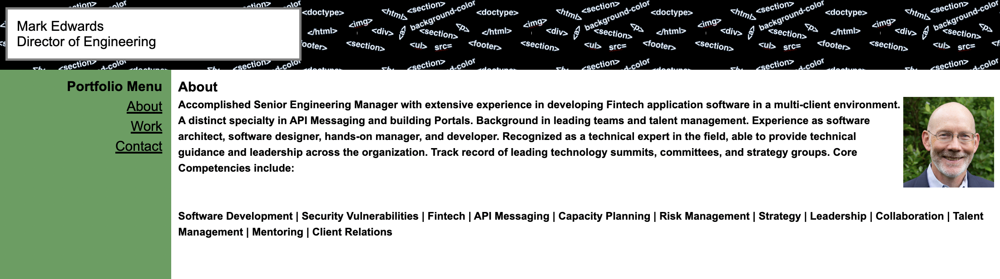
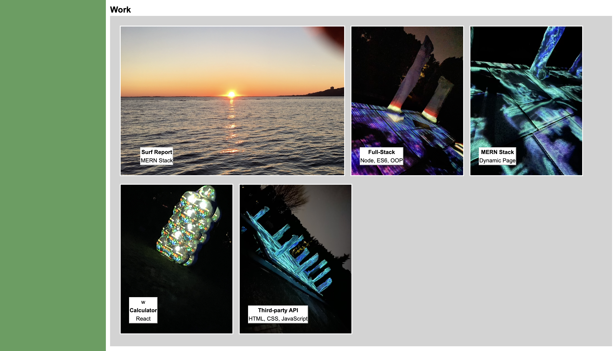

# myprofile
Mark Edwards - Profile

## Author: 
Mark Edwards

## Deployment:
[Live](https://mark-227-g.github.io/myprofile/)
### User Story:
AS AN employer
I WANT to view a potential employee's deployed portfolio of work samples
SO THAT I can review samples of their work and assess whether they're a good candidate for an open position

#### AS A marketing agency
I WANT a codebase that follows accessibility standards
SO THAT our own site is optimized for search engines

#### Acceptance Criteria
```
GIVEN I need to sample a potential employee's previous work
WHEN I load their portfolio
THEN I am presented with the developer's name, a recent photo or avatar, and links to sections about them, their work, and how to contact them
WHEN I click one of the links in the navigation
THEN the UI scrolls to the corresponding section
WHEN I click on the link to the section about their work
THEN the UI scrolls to a section with titled images of the developer's applications
WHEN I am presented with the developer's first application
THEN that application's image should be larger in size than the others
WHEN I click on the images of the applications
THEN I am taken to that deployed application
WHEN I resize the page or view the site on various screens and devices
THEN I am presented with a responsive layout that adapts to my viewport
```

#### Screenshot




#### Technology used:
HTML5 semantic tags and CSS3. Deployed using github pages.


#### References:

* [W3schools](https://www.w3schools.com/html/html5_semantic_elements.asp)
* [devicedocs](https://devdocs.io/css/)
* [javapoint](https://www.javatpoint.com/css-tutorial)


